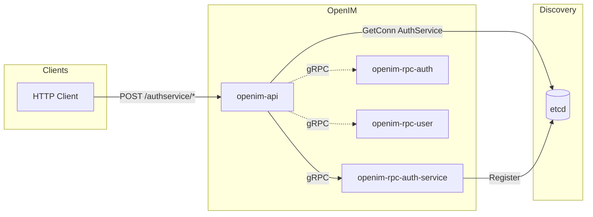

# Adding a New Microservice to OpenIM

This guide walks through adding a new RPC microservice to the OpenIM Server codebase. We use **auth-service** as the example (a hypothetical extra auth-related service). The same steps apply to any new service; substitute your service name where you see `auth-service` or `authservice`.

**Prerequisites:** OpenIM Server repo is already cloned. You are familiar with Go, gRPC, and the layout described in [DEVELOPER.md](../DEVELOPER.md) and [PROCESS_FLOW.md](PROCESS_FLOW.md).

---

## Table of Contents

1. [Repository setup](#1-repository-setup)
2. [Folder structure for the new service](#2-folder-structure-for-the-new-service)
3. [Creating a new protobuf file for the service](#3-creating-a-new-protobuf-file-for-the-service)
4. [Generating gRPC code from protobuf](#4-generating-grpc-code-from-protobuf)
5. [Implementing the RPC server](#5-implementing-the-rpc-server)
6. [Bootstrapping the service with main.go](#6-bootstrapping-the-service-with-maingo)
7. [Configuring service registration](#7-configuring-service-registration)
8. [Wiring requests from openim-api to the new service](#8-wiring-requests-from-openim-api-to-the-new-service)
9. [Integration boundaries](#9-integration-boundaries)
10. [Building and running the service](#10-building-and-running-the-service)
11. [Architecture with the new service](#11-architecture-with-the-new-service)

---

## 1. Repository setup

- **Assumption:** You already have `open-im-server` cloned.
- Ensure Go 1.22+ and dependencies are ready:

```bash
cd /path/to/open-im-server
go mod download
```

- If you need to add or change **protocol** definitions (`.proto`), OpenIM uses the external repo **openimsdk/protocol**. Either:
  - Clone that repo, add your `.proto` there, generate Go code, and publish a new version that open-im-server will depend on via `go.mod`, or
  - Use a local/vendor proto path and generate in this repo (see [§3](#3-creating-a-new-protobuf-file-for-the-service) and [§4](#4-generating-grpc-code-from-protobuf)).

No other repository setup is required inside open-im-server for adding a new service.

---

## 2. Folder structure for the new service

OpenIM keeps each RPC binary under `cmd/openim-rpc/<binary-name>/` and the implementation under `internal/rpc/<short-name>/`.

For **auth-service**, use a hyphenated binary name and a short package name:

| Purpose              | Path (example for auth-service)        |
|----------------------|----------------------------------------|
| Entrypoint binary    | `cmd/openim-rpc/openim-rpc-auth-service/main.go` |
| RPC implementation   | `internal/rpc/authservice/` (or `internal/rpc/auth_service/` if you prefer) |

Convention:

- **cmd:** `cmd/openim-rpc/openim-rpc-<name>/main.go` — one directory per runnable; name matches the binary (e.g. `openim-rpc-auth-service`).
- **internal/rpc:** `internal/rpc/<shortname>/` — all Go code for that RPC (server, config, handlers). Use a short, lowercase name without hyphens for the package (e.g. `authservice`).

Example layout:

```text
open-im-server/
├── cmd/
│   ├── main.go                                    # all-in-one runner (optional integration)
│   └── openim-rpc/
│       ├── openim-rpc-auth/
│       ├── openim-rpc-user/
│       └── openim-rpc-auth-service/               # NEW
│           └── main.go
├── internal/
│   └── rpc/
│       ├── auth/
│       ├── user/
│       └── authservice/                            # NEW
│           ├── server.go                           # Start(), Config, server struct
│           └── auth_service.go                     # RPC method implementations
└── config/
    └── openim-rpc-auth-service.yml                 # NEW (see §7)
```

Create the directories:

```bash
mkdir -p cmd/openim-rpc/openim-rpc-auth-service
mkdir -p internal/rpc/authservice
```

---

## 3. Creating a new protobuf file for the service

### 3.1 Where protos live

- **OpenIM default:** Proto files and generated Go code live in the **openimsdk/protocol** repository. Services in open-im-server depend on `github.com/openimsdk/protocol`.
- For a new service you can:
  - **Option A:** Add the `.proto` in the protocol repo, generate Go there, tag a release, and bump the protocol version in open-im-server’s `go.mod`; or
  - **Option B:** Add the `.proto` under a folder in open-im-server (e.g. `pkg/proto/authservice/`) and generate Go in this repo, then import the generated package.

Below we assume **Option B** (proto inside open-im-server) so the guide is self-contained. If you use Option A, the same message and service definitions apply; only paths and import paths change.

### 3.2 Location and naming (Option B)

- Path: `pkg/proto/authservice/auth_service.proto` (or under your repo’s chosen proto root).
- Naming: `<service_name>.proto`; package and service name in PascalCase (e.g. `AuthService`).

### 3.3 Example proto

```protobuf
syntax = "proto3";

package openim.authservice;

option go_package = "github.com/openimsdk/open-im-server/v3/pkg/proto/authservice;authservice";

// AuthService is an example custom auth-related microservice.
service AuthService {
  // Echo is an example RPC.
  rpc Echo(EchoReq) returns (EchoResp);
  // GetConfig returns a simple config value (example).
  rpc GetConfig(GetConfigReq) returns (GetConfigResp);
}

message EchoReq {
  string message = 1;
}

message EchoResp {
  string message = 1;
}

message GetConfigReq {
  string key = 1;
}

message GetConfigResp {
  string value = 1;
}
```

If you depend on **openimsdk/protocol**, you can add your service to that repo’s existing auth or a new file (e.g. `authservice.proto`) and use that repo’s `go_package` and import paths.

---

## 4. Generating gRPC code from protobuf

### 4.1 OpenIM proto generation workflow

- The **openimsdk/protocol** repo is the source of truth for shared APIs. It uses a protoc-based pipeline to generate Go (and sometimes other languages). OpenIM also documents a custom Protoc bundle: [docs/contrib/protoc-tools.md](contrib/protoc-tools.md).
- In open-im-server, generated code is usually **not** committed; it comes from the protocol module. For a **local** proto in this repo you would:

  1. Install protoc and the Go plugins (`protoc-gen-go`, `protoc-gen-go-grpc`).
  2. Run protoc with the right `--go_out` and `--go-grpc_out` (and `--proto_path`).

Example (if proto is in this repo under `pkg/proto/authservice/`):

```bash
# From repo root
protoc --go_out=. --go_opt=paths=source_relative \
  --go-grpc_out=. --go-grpc_opt=paths=source_relative \
  -I pkg/proto \
  pkg/proto/authservice/auth_service.proto
```

Adjust `go_package` in the proto so the generated files end up in a package that the rest of the code can import (e.g. `github.com/openimsdk/open-im-server/v3/pkg/proto/authservice`).

### 4.2 Using openimsdk/protocol

If your new service is added to **openimsdk/protocol**:

1. Add the `.proto` in that repo.
2. Run that repo’s code generation (see its Makefile or scripts).
3. Publish a new version and in open-im-server run:

```bash
go get github.com/openimsdk/protocol@v0.0.xx
go mod tidy
```

Then in open-im-server you will import the generated client/server from `github.com/openimsdk/protocol/...` (or whatever path that repo uses).

---

## 5. Implementing the RPC server

### 5.1 Location

- **Package:** `internal/rpc/authservice` (or your chosen short name).
- **Files:** At least one file for the server lifecycle and config (e.g. `server.go`) and one for RPC handlers (e.g. `auth_service.go`). You can split by concern (e.g. `config.go`, `server.go`, `handlers.go`).

### 5.2 Config struct

Config must include at least: RPC (listen/register ports), Discovery (so the service can register and find others), and any config file name. Follow the same pattern as existing RPCs (e.g. `internal/rpc/auth/auth.go`):

```go
// internal/rpc/authservice/server.go
package authservice

import (
	"github.com/openimsdk/open-im-server/v3/pkg/common/config"
)

type Config struct {
	RpcConfig   config.AuthService   // Add AuthService type in pkg/common/config (same shape as config.Auth/config.Conversation; GetConfigFileName returns OpenIMRPCAuthServiceCfgFileName).
	Discovery   config.Discovery
	Share       config.Share
	// Add any service-specific config.
}
```

In `pkg/common/config` you must add: (1) a constant `OpenIMRPCAuthServiceCfgFileName = "openim-rpc-auth-service.yml"`, and (2) a config type (e.g. `AuthService`) with the same fields as other RPC configs (`RPC`, `Prometheus`, `RateLimiter`, `CircuitBreaker`) and a method `GetConfigFileName() string` that returns `OpenIMRPCAuthServiceCfgFileName`. Use that type for `Config.RpcConfig` so the correct YAML file is loaded.

### 5.3 Server struct and Start

- The server struct embeds `pb.UnimplementedAuthServiceServer` and holds config, discovery, and any dependencies.
- `Start` should: load config, get discovery client, create the gRPC server, register the service, and then let `startrpc.Start` handle listening and etcd registration (see [§6](#6-bootstrapping-the-service-with-maingo)).

```go
// internal/rpc/authservice/server.go
package authservice

import (
	"context"

	"github.com/openimsdk/open-im-server/v3/pkg/common/config"
	pb "github.com/openimsdk/open-im-server/v3/pkg/proto/authservice"
	"github.com/openimsdk/tools/discovery"
	"google.golang.org/grpc"
)

type authServiceServer struct {
	pb.UnimplementedAuthServiceServer
	config *Config
}

func Start(ctx context.Context, cfg *Config, client discovery.SvcDiscoveryRegistry, server grpc.ServiceRegistrar) error {
	s := &authServiceServer{config: cfg}
	pb.RegisterAuthServiceServer(server, s)
	return nil
}
```

If your proto and generated code live in openimsdk/protocol, replace the `pb` import with the correct path from that repo.

### 5.4 Implementing RPC methods

```go
// internal/rpc/authservice/auth_service.go
package authservice

import (
	"context"

	"github.com/openimsdk/open-im-server/v3/pkg/common/config"
	pb "github.com/openimsdk/open-im-server/v3/pkg/proto/authservice"
	"github.com/openimsdk/tools/errs"
)

func (s *authServiceServer) Echo(ctx context.Context, req *pb.EchoReq) (*pb.EchoResp, error) {
	if req == nil || req.Message == "" {
		return nil, errs.ErrArgs.WrapMsg("message required")
	}
	return &pb.EchoResp{Message: req.Message}, nil
}

func (s *authServiceServer) GetConfig(ctx context.Context, req *pb.GetConfigReq) (*pb.GetConfigResp, error) {
	// Example: read from s.config or a key-value store.
	return &pb.GetConfigResp{Value: "example-value"}, nil
}
```

Use `github.com/openimsdk/tools/errs` and `github.com/openimsdk/tools/log` for errors and logging; avoid `panic` and the standard `log` package.

### 5.5 internal/logic/ (optional)

OpenIM does not always have a separate `internal/logic/` layer. Many RPCs implement logic directly in `internal/rpc/<service>/`. If you want a clear boundary, you can add:

- `internal/rpc/authservice/logic/` — pure business logic, no gRPC types.
- RPC handlers in `internal/rpc/authservice/` call into `logic` and convert between protobuf and internal types.

For a small service, keeping handlers in `internal/rpc/authservice/` is acceptable and matches several existing OpenIM RPCs.

---

## 6. Bootstrapping the service with main.go

Each RPC binary is started by a **cobra** command that loads config, sets up discovery, and calls `startrpc.Start` with the service’s `Start` function.

### 6.1 Command struct and config map

Follow the same pattern as `pkg/common/cmd/auth.go` or `user.go`:

- A `*RpcCmd` struct embeds `*RootCmd` and holds a config map and the service config struct.
- Config map: keys = config file names, values = pointers to the struct fields that correspond to those files (e.g. `openim-rpc-auth-service.yml` → RpcConfig, plus `redis.yml`, `share.yml`, `discovery.yml`, etc. as needed).

### 6.2 Example: auth-service RPC command

Create `pkg/common/cmd/auth_service_rpc.go`:

```go
package cmd

import (
	"context"

	"github.com/openimsdk/open-im-server/v3/internal/rpc/authservice"
	"github.com/openimsdk/open-im-server/v3/pkg/common/config"
	"github.com/openimsdk/open-im-server/v3/pkg/common/startrpc"
	"github.com/openimsdk/open-im-server/v3/version"
	"github.com/openimsdk/tools/system/program"
	"github.com/spf13/cobra"
)

type AuthServiceRpcCmd struct {
	*RootCmd
	ctx        context.Context
	configMap  map[string]any
	svcConfig  *authservice.Config
}

func NewAuthServiceRpcCmd() *AuthServiceRpcCmd {
	var svcConfig authservice.Config
	ret := &AuthServiceRpcCmd{svcConfig: &svcConfig}
	ret.configMap = map[string]any{
		config.OpenIMRPCAuthServiceCfgFileName: &svcConfig.RpcConfig, // Add this constant in pkg/common/config
		config.ShareFileName:                    &svcConfig.Share,
		config.DiscoveryConfigFilename:          &svcConfig.Discovery,
	}
	ret.RootCmd = NewRootCmd(program.GetProcessName(), WithConfigMap(ret.configMap))
	ret.ctx = context.WithValue(context.Background(), "version", version.Version)
	ret.Command.RunE = func(cmd *cobra.Command, args []string) error {
		return ret.runE()
	}
	return ret
}

func (a *AuthServiceRpcCmd) Exec() error {
	return a.Execute()
}

func (a *AuthServiceRpcCmd) runE() error {
	return startrpc.Start(a.ctx,
		&a.svcConfig.Discovery,
		&a.svcConfig.RpcConfig.CircuitBreaker,
		&a.svcConfig.RpcConfig.RateLimiter,
		&a.svcConfig.RpcConfig.Prometheus,
		a.svcConfig.RpcConfig.RPC.ListenIP,
		a.svcConfig.RpcConfig.RPC.RegisterIP,
		a.svcConfig.RpcConfig.RPC.AutoSetPorts,
		a.svcConfig.RpcConfig.RPC.Ports,
		a.Index(),
		a.svcConfig.Discovery.RpcService.AuthService, // discovery name (see §7)
		nil,
		a.svcConfig,
		[]string{
			a.svcConfig.RpcConfig.GetConfigFileName(),
			a.svcConfig.Share.GetConfigFileName(),
			a.svcConfig.Discovery.GetConfigFileName(),
		},
		nil,
		authservice.Start)
}
```

You must add:

- `config.OpenIMRPCAuthServiceCfgFileName` (e.g. `"openim-rpc-auth-service.yml"`).
- A config struct that implements `GetConfigFileName()` (or reuse one that matches).
- `config.Discovery.RpcService.AuthService` — the discovery name string (see [§7](#7-configuring-service-registration)).

### 6.3 main.go for the binary

```go
// cmd/openim-rpc/openim-rpc-auth-service/main.go
package main

import (
	"github.com/openimsdk/open-im-server/v3/pkg/common/cmd"
	"github.com/openimsdk/tools/system/program"
)

func main() {
	if err := cmd.NewAuthServiceRpcCmd().Exec(); err != nil {
		program.ExitWithError(err)
	}
}
```

This follows the same pattern as `cmd/openim-rpc/openim-rpc-auth/main.go`.

---

## 7. Configuring service registration

So that other OpenIM components can discover and call the new service, you need: a config file for the RPC, a discovery name, and (if using the all-in-one runner) registering it there too.

### 7.1 RPC config file

Create `config/openim-rpc-auth-service.yml` (mirroring `openim-rpc-auth.yml`):

```yaml
rpc:
  registerIP:
  listenIP: 0.0.0.0
  autoSetPorts: true
  ports:

prometheus:
  enable: true
  ports:

ratelimiter:
  enable: false
  window: 20s
  bucket: 500
  cpuThreshold: 850

circuitBreaker:
  enable: false
  window: 5s
  bucket: 100
  success: 0.6
  request: 500
```

When `autoSetPorts` is true, the service picks a port and registers it with etcd. For fixed ports, set `autoSetPorts: false` and fill `rpc.ports` and `prometheus.ports`.

### 7.2 Discovery config: RpcService name

In `config/discovery.yml`, add a name for the new service under `rpcService`:

```yaml
rpcService:
  user: user-rpc-service
  friend: friend-rpc-service
  msg: msg-rpc-service
  push: push-rpc-service
  messageGateway: messagegateway-rpc-service
  group: group-rpc-service
  auth: auth-rpc-service
  conversation: conversation-rpc-service
  third: third-rpc-service
  authService: auth-service-rpc-service   # NEW: name other services use to discover this one
```

In `pkg/common/config/config.go`, extend `RpcService` and `GetServiceNames()`:

```go
type RpcService struct {
	// ... existing fields ...
	AuthService string `yaml:"authService"`
}

func (r *RpcService) GetServiceNames() []string {
	return []string{
		// ... existing names ...
		r.AuthService,
	}
}
```

Ensure the default/standalone behavior sets this name when discovery is standalone (see `initDiscovery` in `cmd/main.go`: it sets unexported fields from the struct field name, so a field `AuthService` would get the string `"AuthService"` unless overridden by config).

### 7.3 start-config.yml (when using mage/gomake)

If you run services via the repo’s start script or mage and it reads `start-config.yml`, add the new binary and instance count:

```yaml
serviceBinaries:
  openim-api: 1
  openim-rpc-auth: 1
  openim-rpc-auth-service: 1   # NEW
  # ...
```

---

## 8. Wiring requests from openim-api to the new service

To expose the new service over the REST API, openim-api must get a gRPC client to it and add routes that call that client.

### 8.1 Get a connection in the API router

In `internal/api/router.go`, in `newGinRouter`:

1. Add a call to get a connection to the new service using the discovery name you added to `RpcService`:

```go
authServiceConn, err := client.GetConn(ctx, cfg.Discovery.RpcService.AuthService)
if err != nil {
	return nil, err
}
```

2. Create an API wrapper that holds the gRPC client (same pattern as `NewAuthApi`, `NewUserApi`, etc.):

```go
authServiceClient := pbauthservice.NewAuthServiceClient(authServiceConn)
authServiceApi := NewAuthServiceApi(authServiceClient)
```

### 8.2 Define the API handler type and routes

In a new file (e.g. `internal/api/auth_service_api.go`):

```go
package api

import (
	"github.com/gin-gonic/gin"
	"github.com/openimsdk/tools/a2r"
	pb "github.com/openimsdk/protocol/authservice"  // or your generated package
)

type AuthServiceApi struct {
	Client pb.AuthServiceClient
}

func NewAuthServiceApi(client pb.AuthServiceClient) AuthServiceApi {
	return AuthServiceApi{Client: client}
}

func (o *AuthServiceApi) Echo(c *gin.Context) {
	a2r.Call(c, pb.AuthServiceClient.Echo, o.Client)
}

func (o *AuthServiceApi) GetConfig(c *gin.Context) {
	a2r.Call(c, pb.AuthServiceClient.GetConfig, o.Client)
}
```

`a2r.Call` maps the Gin context (JSON body and response) to the gRPC method.

### 8.3 Register routes

In `newGinRouter`, add a route group and bind POST handlers:

```go
authServiceGroup := r.Group("/authservice")
{
	authServiceGroup.POST("/echo", authServiceApi.Echo)
	authServiceGroup.POST("/get_config", authServiceApi.GetConfig)
}
```

Clients will call `POST /authservice/echo` and `POST /authservice/get_config` with JSON bodies that match the proto request messages. If the route must be protected by token, the group uses the same middleware as other authenticated routes (e.g. the token middleware already applied to `r`).

---

## 9. Integration boundaries

### 9.1 What NOT to edit (keep OpenIM core behavior)

- **Core message pipeline:** Do not change how messages flow from openim-rpc-msg → Kafka (ToRedisTopic) → openim-msgtransfer → Redis/Mongo/Push unless you are intentionally extending that pipeline. Do not add or remove Kafka topics used by core IM.
- **Protocol and SDK contracts:** Do not change existing request/response types or RPC names in openimsdk/protocol (or the shared proto you use) for existing services; that would break SDKs and clients.
- **Existing RPC implementations:** Do not modify internal logic of auth, user, msg, group, friend, conversation, third, or push for the sole purpose of wiring your service; call your service from API or from another RPC via discovery instead.
- **Discovery and config layout:** Keep etcd and config file naming consistent; add new entries (new service name, new config file) rather than renaming or removing existing ones.
- **Gateway and transfer:** Do not change openim-msggateway or openim-msgtransfer behavior (WebSocket protocol, Kafka consumption) unless you are adding a supported extension point.

### 9.2 What is allowed

- **New RPC service:** Add new binaries under `cmd/openim-rpc/`, new packages under `internal/rpc/`, new config files under `config/`, and new discovery names.
- **New proto (or new methods):** Add new `.proto` files or new methods in the protocol repo (or local proto) and generate new Go code; use new packages or new service names so existing ones are unchanged.
- **API wiring:** Add new routes and new gRPC clients in openim-api to call your (or any) RPC.
- **Config and discovery:** Add fields to `RpcService`, new config structs, and new YAML files for the new service.
- **Optional all-in-one runner:** If you use the single-binary runner in `cmd/main.go`, you may register your service’s `Start` there (see [§6](#6-bootstrapping-the-service-with-maingo)); otherwise run the new binary separately.

---

## 10. Building and running the service

### 10.1 Build

From the repo root:

```bash
# Build all binaries (includes the new one if the build list includes it)
mage build

# Or build only the new RPC binary
mage build openim-rpc-auth-service
```

Binaries are produced under `_output/` (exact path depends on OS/arch and gomake config). If your build system enumerates binaries from `cmd/`, ensure `cmd/openim-rpc/openim-rpc-auth-service` is included.

### 10.2 Run with the rest of OpenIM

- **Config path:** Set `OPENIMCONFIG` or pass `--config_folder_path` to the binary so it finds `config/` (including `openim-rpc-auth-service.yml` and `discovery.yml`).

- **Dependencies:** Start etcd (and optionally Redis, MongoDB, etc.) if your service or discovery depends on them. Other OpenIM services (e.g. openim-api) must be running if you want to call the new service via the API.

- **Start a single binary:**

```bash
export OPENIMCONFIG=/path/to/open-im-server/config
_output/bin/platforms/linux/amd64/openim-rpc-auth-service -c $OPENIMCONFIG
```

- **Start all services (mage):** If you added the binary to the project’s start list and `start-config.yml`:

```bash
mage start
```

Use `mage check` to see if processes are up, and `mage stop` to stop them.

### 10.3 Quick sanity check

1. Start etcd and the new RPC: `openim-rpc-auth-service -c config`.
2. Start openim-api (so it can discover and call the new RPC).
3. Call the new API:  
   `curl -X POST http://localhost:10002/authservice/echo -H "Content-Type: application/json" -d '{"message":"hello"}'`  
   (adjust port and path to your API and route.)

---

## 11. Architecture with the new service

### 11.1 Diagram (Mermaid)



### 11.2 Description

- **Clients** send HTTP requests to **openim-api** (e.g. `POST /authservice/echo`).
- **openim-api** uses **discovery** (etcd) to resolve the name `authService` (or whatever you set in `RpcService`) to the address of **openim-rpc-auth-service**, then calls it over gRPC.
- **openim-rpc-auth-service** registers itself with etcd on startup (handled by `startrpc.Start`). It does not replace the existing **openim-rpc-auth**; both can coexist. The new service is an additional microservice that the API (or other RPCs) can call when you wire it in.

This keeps the existing IM pipeline (msg → Kafka → msgtransfer → Redis/Mongo/push) unchanged and adds a separate, discoverable RPC that you can extend with more methods and config as needed.

---

## Summary checklist

- [ ] Repository ready; proto location decided (protocol repo vs local).
- [ ] Folders created: `cmd/openim-rpc/openim-rpc-auth-service/`, `internal/rpc/authservice/`.
- [ ] Proto defined and Go code generated; package importable.
- [ ] `internal/rpc/authservice`: Config, server struct, `Start`, RPC handlers implemented.
- [ ] `pkg/common/cmd`: New RPC command (e.g. `AuthServiceRpcCmd`) and `Exec()`/`runE()` calling `startrpc.Start` with the service’s discovery name and `Start` function.
- [ ] `cmd/openim-rpc/openim-rpc-auth-service/main.go` calls the new command’s `Exec()`.
- [ ] `pkg/common/config`: New config file name constant, RpcService field and GetServiceNames entry, and (if needed) a config struct with `GetConfigFileName()`.
- [ ] `config/openim-rpc-auth-service.yml` and `config/discovery.yml` (rpcService name) updated.
- [ ] `start-config.yml` updated if you use it.
- [ ] openim-api: `GetConn` for the new service, new API struct and handlers, routes under e.g. `/authservice`.
- [ ] Build: `mage build openim-rpc-auth-service` (or equivalent).
- [ ] Run and test with etcd and openim-api.

For more on the codebase and request flow, see [DEVELOPER.md](../DEVELOPER.md), [PROCESS_FLOW.md](PROCESS_FLOW.md), and [TECHNOLOGY.md](TECHNOLOGY.md).
